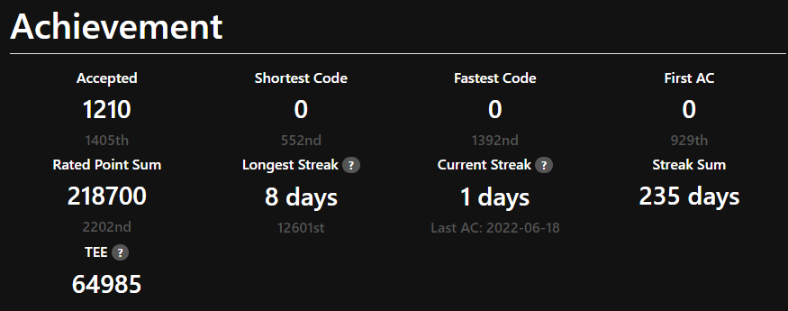
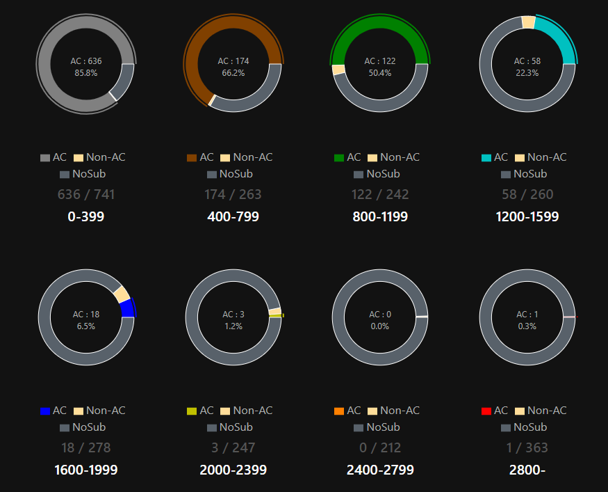

## これはなに
AtCoderで青になったので，それの色変記事です．喜びを綴ります．
この記事は自分語りと自己満足で成り立っています．お役立ち情報はあればいいのですが，ないです．

## 自己紹介
- 高専4年生で情報科の学生(高専4年は，大学1年に相当する学年)です．
  - 情報科ですが，授業でアルゴリズムをガッツリ学習することはないため，これによるアドバンテージはあまり大きくないと思います．
- 

### 期間
始めてから青になるまで，2年と8ヶ月弱かかっているようです．
また，[水色](https://shibaken-8128.hatenablog.com/entry/2020/12/02/133212?_ga=2.109126533.1263764781.1655566696-211801955.1617710226)から青色になるまで，約1年半かかっています．長いですね．

## このくらい解いた
[AtCoderProblems](https://kenkoooo.com/atcoder/#/user/shibaken496)からの情報です．

虚無埋のせいで，AC数の割にRPSがかなり少ないです．また，Streakについてもあまり気にしていませんでした．

毎日精進！という感じではなく，毎週コンテストがあるから気分転換に出る，たまに新しいアルゴリズムに触れてみる，暇なので典型90を埋めてみる，という比較的ゆるいスタンスでやっていました．

典型的なアルゴリズム自体は，だいたい知っているので，あとはコンテストにひたすら出て使い方を学ぶ，という気持ちで出ていました．

Difficulity Piesから分かる通り，水色の期間が1年半も続いたのにもかかわらず，水difのAC数が58です．恥ずかしい．

こういうタイプもいる，という一例として見ていただけると幸いです．

## 高専数学について
高専数学は，受験ではなく道具として使うことを目的に勉強するため，ベクトルや微積を除いた範囲は1年生のときに基礎だけ詰め込まれます．

この基礎だけでは競プロで使う数学には少し物足りないです．特に，次の分野については独学が必要になります．
- 組み合わせ論
  - 特に重複組合せの考え方は頻出です
- 整数論
  - GCDやLCD，modについては高専数学では全く触れませんでした

高校数学については[OMC](https://onlinemathcontest.com/contests/all)でも勉強しています．

## もっと早く知りたかったこと
### ブラウザ拡張機能
[AtCoder Clans](https://kato-hiro.github.io/AtCoderClans/scripts#gsc.tab=0)にある拡張機能を片っ端から入れました．

特に，提出前にテストケースを自動で試してくれる，Test&submitによってコメントアウトのし忘れのような無意味なWAの心配がなくなりました．

序盤の時短にも繋がります．

### VSCode拡張機能
スニペットを準備することで，別のファイルからセグ木やSCCなどのテンプレをコピペしてくる，といった手間がなくなります．

### グラフ可視化サービス
[GRAPHxGRAPH](https://hello-world-494ec.firebaseapp.com/)はグラフ問題の入力例を可視化してくれます．

### C++の機能，仕様
競プロ純粋培養C++erであった僕は，便利な関数や機能を知りませんでした．例えば次のとおりです．
- `map`や`set`に対する範囲for文 
  - APG4bには配列や文字列について使えると書いてありますが，`set`や`map`，二次元の`vector`にも使えることを知っているとプログラムがかなり簡潔になりますね．
- `lower_bound`，`clamp`，`next_permutation`，比較関数，ラムダ式，テンプレートなどなど...

[競プロに便利な C++17 新機能まとめ](https://qiita.com/Reputeless/items/db7dda0096f3ae91d450)を見ると，世界が変わります．

### dc言語
四則演算をするだけの問題に対して，dc言語は数bytesでコードを書くことができます．早解きは大事です．

## 大切なこと
### コンテストに出る
レートが下がるからコンテストに出ない，はもったいないです．コンテストでじっくり時間を使って考えることに意味があります．考えれば考えるほど，解説が身に染みます．いつも，「欲しいのはレートよりも経験値」「楽しいゲームだから」の精神で出ます．
### Twitter
他の人から刺激を受けることやモチベーションに繋がります．
AtCoderをやっていれば，AtCoderをやっている人は大抵フォロバしてくれるのでどんどんフォローします．
コンテスト後の余韻はTwitterがあるからこそ浸ることができます．この時間が楽しい．
高いパフォーマンスを出して，みんなからいいねをもらうことで承認欲求も満たされます．

### 周りを気にしすぎない
自分より2色上くらいのユーザーはみんな人外だと思います．人は競プロだけじゃないです．

## 競プロやっててよかったこと
### 楽しい
楽しいから競プロをやっています．
気分転換に，緑difくらいの問題をパズル感覚で解くのが楽しいです．
### 高専プロコンで入賞
高専プロコンの競技部門で，4位にあたる成績を取りました．ヒューリスティックな問題でしたが，アルゴの知識もかなり役立ちました．

## 競プロで失ったもの
完全に僕自身の生態によるものです．
### 人と話ができない
Twitterでつながっている方々は，みんな競プロerであるため，当然競プロの話が通じます．

しかし，この感覚で日常で出会う人と会話するとどうでしょうか．「この前のD問題が」「hypot関数知らんかったこれ便利だわ」「う　し　た　ぷ　に　き　あ　く　ん　笑」．こういう話題が使えなくなるため，お話の種がありません．ああ困った．

## 終わりに

